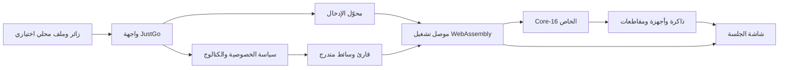
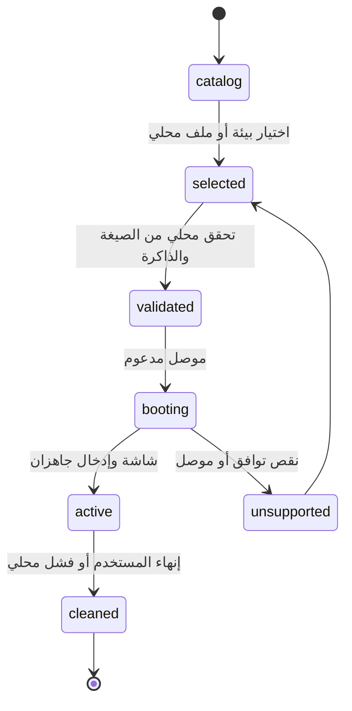

# JustGo Local Engine Architecture

> **حالة الوثيقة:** بنية محلية متنامية قابلة للاختبار. يعمل التنفيذ داخل متصفح الزائر، ولا يدّعي تشغيل Windows أو macOS حتى يثبت ذلك عبر مكونات وتوافق قانوني محدد.

## 1. وعد التجربة

يفتح الزائر JustGo، يختار بيئة اختبار مفتوحة أو وسيطاً محلياً يملك حق استعماله، ثم يرى جلسة داخل علامة التبويب. لا يُرفع ملف الوسيط، ولا يحتاج المستخدم إلى خادم جلسات أو شاشة إعداد خارجية. هذا لا يعني أن كل ISO قابل للإقلاع؛ توافق كل وسيط نتيجة اختبار موثق.

## 2. الرسم المنطقي

## 3. الوحدات الحالية

| الوحدة | المسؤولية | الحالة |
|---|---|---|
| **واجهة الجلسة** | اختيار البيئة والذاكرة والمفتاح الاختياري المحلي ورسائل الحدود | نشطة |
| **Input Control** | Pointer Lock حيث يتوفر وPointer Events/لمس مباشر كبديل iOS | نشطة؛ اختبار iOS الحقيقي مؤجل |
| **Local Media** | قراءة قطاعات ISO/IMG عند الطلب من `File` محلي | نشطة في مسار المحرك الخاص |
| **v86 Bridge** | تشغيل FreeDOS الاختباري محلياً داخل WebAssembly | نشط؛ موصل اختياري لا نواة JustGo |
| **Core-16** | CPU real-mode صغير، ذاكرة، منافذ، كتل مخزنة ومقاطعات | نشط ومتنامٍ |
| **Firmware / Devices** | ROM reset vector وPIT وPS/2 وVGA نصي وقرص قطاعات | نشط كنماذج قابلة للاختبار |
| **Protected Foundation** | GDT وsegment descriptors وpaging 32-bit | نشط لكنه غير مربوط بعد بتنفيذ تعليمات 386 |
| **Integration Registry** | سجل أصل وترخيص ودور وحدود المحركات الخارجية | نشط |

## 4. دورة تشغيل الوسيط المحلي

## 5. سياسة الوسائط والخصوصية

1. لا ترفع JustGo ملفات ISO/IMG أو تحفظها في Git أو التحليلات أو التخزين المحلي افتراضياً.
2. يقرأ قارئ الوسائط القطاعات عند الطلب لتجنب نسخ ملف كبير كاملاً إلى RAM في مسار المحرك الخاص.
3. مفتاح Windows، إن أُدخل، يبقى في ذاكرة الصفحة فقط ولا يفعّل أو يتحقق أو يرسل إلى الشبكة.
4. لا تُضمّن JustGo Windows أو BIOS أو برامج مملوكة لطرف ثالث؛ تثبت كل بيئة من مصدرها وترخيصها منفصلين.

## 6. سياسة التكامل الخارجي

كل محرك خارجي يسجل في `src/integration` مع المصدر والرخصة والدور والإشعار المطلوب. v86 موصل BSD-2-Clause مع إشعارات تبعياته، بينما QEMU/TCG وBochs وTinyEMU وJSLinux وPCjs مراجع أو مرشحون بحدود واضحة في `docs/engine-integration-review.md`. لا تُحوّل وحدة مرجعية إلى مكوّن تشغيلي بلا مراجعة ترخيص واختبار وتوثيق.

## 7. حدود المرحلة الحالية

| قدرة | الواقع الحالي |
|---|---|
| FreeDOS | يقلع في المتصفح عبر موصل v86 المحلي |
| بيئات مفتوحة أخرى | مدرجة كمرشحات؛ لا تُرفق قبل تدقيق الإصدار والرخصة والتوافق |
| Windows 7/10 | غير مرفقين وغير مدعومين في Core-16؛ الوسيط القانوني لا يضمن الإقلاع |
| x86 32-bit | أساس GDT وpaging موجود؛ تعليمات 386 وامتداد الأجهزة لم تُنفذ بعد |
| iOS | بديل لمس/Pointer Events موجود؛ الاختبار الميداني معلق حتى يتوفر رابط تجريبي مصرح به |

## 8. قياس النجاح

تقاس المرحلة التالية بتغطية التعليمات، دقة المقاطعات والأجهزة، ثبات الذاكرة، اختبارات الوسائط المحلية، نسبة الإقلاعات المدعومة فعلاً، وعزل الخصوصية. لا يقاس النجاح بعدد الملفات أو الأسطر؛ تنمو الأسطر عندما تنمو التغطية والاختبارات والوثائق معاً.
