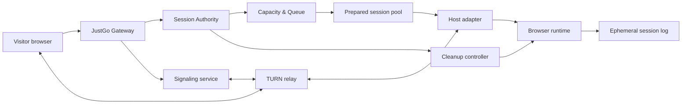
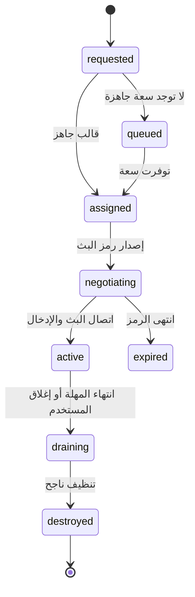

# JustGo Engine Architecture

> **حالة الوثيقة:** تصميم أولي قابل للتنفيذ. لا يدّعي تشغيل macOS أو Windows من الموقع نفسه؛ يحدد طريقة الربط بمضيف تنفيذ مشروع عند توفره.

## 1. وعد التجربة

يدخل المستخدم عنوان URL، يختار ملف متصفح، ثم يحصل على نافذة متصفح بعيدة جاهزة. لا يرى إعداد نظام، ولا ISO، ولا شاشة إقلاع. تعني كلمة "جاهزة" أن القالب قد أُنشئ قبل التخصيص أو يُحضَّر في الخلفية، وليس أن الواجهة تتظاهر بوجود نظام يعمل.

## 2. الرسم المنطقي



## 3. الوحدات الأساسية

| الوحدة | المسؤولية | لا تفعل |
|---|---|---|
| **Gateway** | يتحقق من الطلب ويصدر صفحة الجلسة ورمزاً قصير العمر | لا يتصل مباشرة بعنوان المضيف الداخلي |
| **Session Authority** | ينشئ حالة الجلسة وينفذ السياسة والمهلة وحد التزامن | لا يشغّل متصفحاً بنفسه |
| **Capacity & Queue** | يختار قالباً جاهزاً أو يضع الطلب في طابور محدود | لا يمنح انتظاراً غير محدود |
| **Host Adapter** | يترجم عقدة الجلسة إلى تشغيل Chromium أو RDP/VNC أو مضيف Mac | لا يقرر هوية المستخدم أو التفويض |
| **Interactive Relay** | يمرر الفيديو/الصوت والمدخلات عبر WebRTC وTURN | لا يحتفظ بملف تعريف أو ملفات المستخدم |
| **Cleanup Controller** | يمحو الجلسة وينهي العمليات ويلغي الرموز عند المهلة | لا يترك جلسات يتيمة |
| **Operational Ledger** | يسجل أحداثاً تشغيلية دنيا: وقت الإنشاء، الحالة، سبب الإنهاء | لا يسجل عناوين الصفحات أو ضغطات المفاتيح أو محتوى التصفح |

## 4. حالات الجلسة



## 5. عقود الحدود

كل عقد منفصل حتى يمكن اختبار المحرك اليوم مع مضيف تجريبي، ثم تبديل التنفيذ الفعلي لاحقاً.

```ts
export type RuntimeKind = "chromium-linux" | "windows-rdp" | "macos-vnc";

export interface LaunchRequest {
  targetUrl: string;
  runtime: RuntimeKind;
  viewport: { width: number; height: number; deviceScaleFactor: number };
  requestedAt: string;
}

export interface SessionLease {
  id: string;
  runtime: RuntimeKind;
  state: "assigned" | "negotiating" | "active";
  expiresAt: string;
  connectionToken: string;
}

export interface HostAdapter {
  reserve(request: LaunchRequest): Promise<SessionLease>;
  attach(sessionId: string, connectionToken: string): Promise<void>;
  destroy(sessionId: string, reason: "expired" | "closed" | "policy" | "failed"): Promise<void>;
  health(): Promise<{ ready: boolean; capacity: number }>;
}
```

## 6. سياسة الأمان في الإصدار الأول

1. جلسة Chromium/Linux واحدة فقط لكل زائر مجهول، بمدة قصيرة ومسح تام عند النهاية.
2. لا رفع ملفات، ولا تنزيلات، ولا الحافظة، ولا كاميرا/ميكروفون، ولا جلسات محفوظة افتراضياً.
3. لا تلغى حماية العزل ولا يجرى تشغيل المتصفحات كـ root عند التعامل مع مواقع غير موثوقة.
4. تستخدم رموز جلسة قصيرة، ويمنع المضيف الطلبات من خارج Gateway.
5. لا تسمح النسخة العامة بتشغيل الملفات التنفيذية أو أدوات النظام؛ هي مختبر متصفح فقط.

## 7. اختيار التنفيذ

| نوع التشغيل | متى يستخدم | حالة JustGo |
|---|---|---|
| Chromium داخل Linux مع بث WebRTC | البداية القابلة للتشغيل والاختبار | المسار الأول |
| Windows مرخّص + RDP/VNC/WebRTC | اختبار Edge/Chrome على Windows | موصل لاحق، لا ISO للمستخدم |
| Mac مشروع + Safari + VNC/WebRTC | Safari/macOS الحقيقي | موصل لاحق يتطلب عتاد Mac مشروع |

## 8. قياس النجاح

يُقاس نجاح المحرك بزمن تخصيص الجلسة، سلامة التنظيف، منع تجاوز الحصة، إعادة استخدام القوالب بأمان، جودة الإدخال والبث، ونسبة الجلسات السليمة. لا يُقاس بعدد الملفات أو الأسطر البرمجية.
