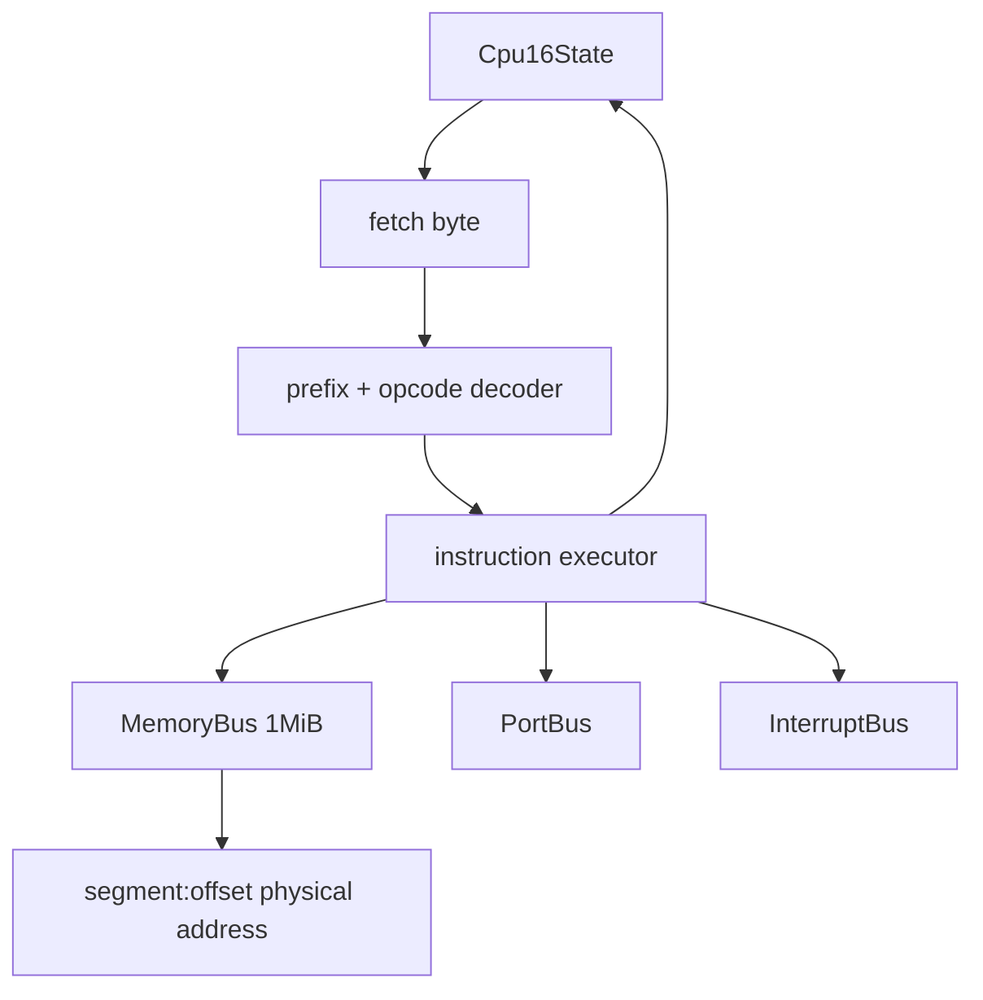

# JustGo Core-16: تصميم النواة الأولى

## نطاق مقصود وصريح

Core-16 ليس بديلاً عن QEMU أو v86 ولا يعد بإقلاع Windows. إنه محرك 8086 real-mode مستقل في TypeScript يثبت أن JustGo يملك نواة قابلة للاختبار، قبل التوسع إلى 286/386 أو أجهزة PC.

| يدخل في Core-16 | يؤجل عمداً |
|---|---|
| سجلات 16-bit وIP وFLAGS | protected mode وpaging |
| ذاكرة 1MiB وsegment:offset | 32/64-bit code |
| fetch/decode/execute حلقي | JIT إلى Wasm |
| MOV، arithmetic، CMP، jumps، stack، HLT | كامل x86 instruction set |
| منافذ I/O كعقدة مجردة | PIC/PIT/VGA/IDE حقيقية |
| ناقل مقاطعات بسيط | BIOS وboot sector |

## طبقات التنفيذ



## عقود TypeScript

```ts
export interface Cpu16State {
  ax: number; bx: number; cx: number; dx: number;
  sp: number; bp: number; si: number; di: number;
  cs: number; ds: number; es: number; ss: number;
  ip: number; flags: number; halted: boolean;
}

export interface MemoryBus {
  read8(address: number): number;
  read16(address: number): number;
  write8(address: number, value: number): void;
  write16(address: number, value: number): void;
}

export interface PortBus {
  in8(port: number): number;
  out8(port: number, value: number): void;
}
```

## مبادئ صحة لا يمكن التنازل عنها

1. تُخزّن كل القيم في نطاقها المنطقي: `u8` و`u16` مع masking واضح؛ JavaScript لا يضمن ذلك تلقائياً.
2. كل عملية stack تستخدم `SS:SP`، وكل جلب instruction يستخدم `CS:IP`، ولا تخلط segment base مع offset.
3. لا تُحدّث FLAGS إلا عبر دوال موحدة قابلة للاختبار، لأن carry/zero/sign/overflow مصدر أخطاء متكررة.
4. decoder يفشل برسالة opcode غير مدعوم بدلاً من تخمين سلوك أو تخطي byte.
5. كل instruction test يبني برنامج bytes صغيراً ويتحقق من state والذاكرة والخطوة التالية؛ لا يعتمد على لقطة واجهة.

## أول خريطة للتعليمات

| المجموعة | تعليمات البداية | سبب الأولوية |
|---|---|---|
| register immediates | `MOV r16, imm16` | تشغيل برامج اختبار قصيرة |
| arithmetic | `ADD`, `SUB`, `INC`, `DEC`, `CMP` | flags والفروع |
| control | `JMP`, `JZ`, `JNZ`, `LOOP`, `HLT` | loop ونهاية حتمية |
| stack | `PUSH`, `POP`, `CALL`, `RET` | دوال real-mode |
| memory | `MOV AL/AX, moffs`, `MOV moffs, AL/AX` | أساس الذاكرة والأجهزة |
| I/O | `IN AL, imm8`, `OUT imm8, AL` | معبر الأجهزة المستقبلي |

## معيار الخروج من المرحلة

لا نضيف VGA أو قرصاً قبل أن تنجح 100% من اختبارات Core-16 المحددة، ويطبع برنامج مصغر إلى منفذ debug تجريبي ثم يتوقف، مع عداد تعليمات وحدّ خطوات يمنع loop غير منتهٍ من تجميد الواجهة.
