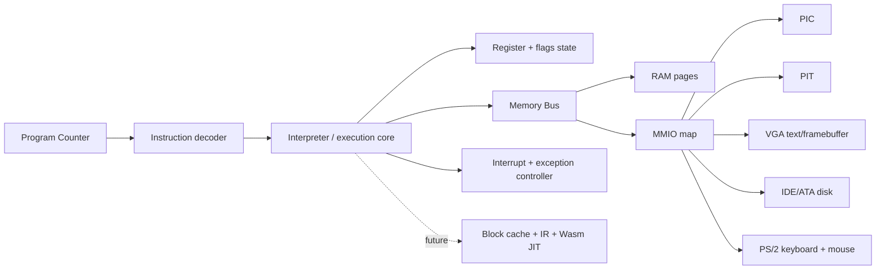

# تقييم هندسي: JustGo Virtualization Engine

> **القرار المختصر:** بناء محرك مستقل ممكن ومفيد كمشروع هندسي متدرج، لكن محركاً جديداً يشغّل Windows 10 في المتصفح بمستوى Browserling ليس مهمة "مئات آلاف الأسطر" فقط؛ إنه برنامج أنظمة متعدد التخصصات يحتاج معالج x86 دقيقاً، ترجمة ديناميكية أو تفسيراً، ذاكرة ومقاطعات وأجهزة افتراضية وBIOS وتخزيناً ورسماً واختبارات توافق واسعة. لذلك نبدأ نواة صادقة قابلة للقياس، ثم لا نوسع الادعاء قبل نتائج الإقلاع والأداء.

## ما الذي نتعلمه من المحركات الأصلية؟

| المصدر | المبدأ الذي يُستفاد منه | أثره على JustGo |
|---|---|---|
| QEMU TCG | الكود الضيف يُقسم إلى **Translation Blocks**؛ تُخزّن افتراضات حالة CPU في الكتلة وتُبطل عند تغيرها أو تعديل الكود. [1] | نفصل التنفيذ إلى interpreter صغير أولاً ثم Block Cache وIR بسيط لاحقاً، ولا نبدأ بـJIT كامل. |
| QEMU software MMU | ترجمة الذاكرة الافتراضية، TLB، التفريق بين RAM وROM وMMIO، وتتبع الصفحات ضرورية لمحاكاة النظام. [1] | `MemoryBus` و`AddressSpace` يجب أن يكونا وحدة مستقلة قبل IDE/VGA أو أي نظام تشغيل. |
| Bochs | حتى المحاكي الدقيق المتنقل يضم CPU وأجهزة I/O وBIOS وذاكرة؛ وتذكر وثائقه أن PIC وPIT وIDE وVGA ولوحة المفاتيح ومؤشر الفأرة مصادر فعلية لصعوبة النمذجة. [2] [3] | لا نعد بWindows لمجرد دعم تعليمات x86؛ الأجهزة والمقاطعات جزء أساسي من المنتج. |
| v86 | يثبت أن x86-to-Wasm JIT وتشغيل أنظمة داخل المتصفح ممكنان، لكن وثائقه تحد من الدعـم وتبين أن بعض بيئات Windows تعمل فقط بشروط. [4] | نستفيد من مبادئ API والاختبار، لا من ادعاء أن محركنا يساوي v86 منذ البداية. |

## وحدات محرك JustGo المقترحة

## مراحل التنفيذ القابلة للقياس

| المرحلة | الناتج القابل للاختبار | نطاق مبدئي | لا تدّعي |
|---|---|---|---|
| **A — Core-16** | سجلات 16-bit وذاكرة 1MiB وdecoder لجزء من 8086 واختبارات تعليمات حتمية | 1,000–2,000 ساعة هندسية | إقلاع DOS أو Windows |
| **B — Real-mode machine** | INT، PIC/PIT، لوحة مفاتيح، VGA نصي، قرص قطاعي، BIOS اختبار صغير | 3,000–6,000 ساعة تراكمية | توافق PC كامل أو أداء إنتاجي |
| **C — Protected-mode lab** | GDT/IDT، paging محدود، 386 instructions، اختبار نواة صغيرة قانونية | 8,000–15,000 ساعة تراكمية | تشغيل Windows 10 |
| **D — Production DBT** | decoder واسع، block cache، إبطال self-modifying code، IR/JIT إلى Wasm، tracing وprofiling | 25,000–60,000+ ساعة تراكمية | تكافؤ Browserling تلقائياً |
| **E — Windows-grade platform** | أجهزة/firmware وتوافق/رسم/تخزين وشبكة وأداء ومتصفح حقيقي حسب الرخصة | برنامج متعدد السنوات وفريق متخصص | "مجاني بلا تكلفة" أو عمل فوري على كل جهاز |

> الأرقام أعلاه **تقدير هندسي للتخطيط وليست حقيقة منشورة**. استخدمت 160 ساعة إنتاجية تقريبية للشهر: 1,200 ساعة ≈ 7.50 أشهر شخص واحد، و4,500 ساعة ≈ 28.12 شهراً، و12,000–30,000 ساعة ≈ 75.00–187.50 شهراً لشخص واحد. زيادة عدد الأشخاص لا تخفّض الزمن خطياً بسبب تعقيد واجهات CPU والأجهزة والاختبارات.

## هل يستحق المسار؟

يستحق إذا كان تعريف النجاح هو بناء **محرك افتراضية ويب مميز وقابل للتعلم والتوسع**، يبدأ بصورة/نواة قانونية خفيفة ويمنح JustGo ملكية طبقة التنفيذ الأساسية. لا يستحق إذا كان تعريف النجاح الوحيد هو تقليد Browserling مع Windows 10 حديث خلال أسابيع؛ عندها يكون استخدام محرك ناضج أو تشغيل خادمي هو المسار الواقعي.

النهج الذي نعتمده هو بناء المحرك من الصفر لكن منضبطاً: لا نسخ كود QEMU أو v86، بل نستلهم الفصل بين CPU/ذاكرة/MMIO/أجهزة/كتل التنفيذ، ونبني الاختبارات قبل توسيع التعليمات. هذا يحول الحجم الكبير إلى جودة قابلة للتحقق بدلاً من أسطر شكلية.

## قرار المرحلة التالية

نبدأ بـ **JustGo Core-16** في TypeScript: حالة CPU، ذاكرة مقيدة، decoder صغير، تنفيذ تعليميات أساسية، نظام منافذ I/O، ومجموعة اختبارات. سيثبت ذلك أن المحرك ملكنا فعلاً. ولا نزيل موصل v86 من تجربة الواجهة إلا بعد أن يثبت Core-16 نتائج صحيحة؛ المحرك المستقل هو مسار طويل، لا إصلاح سريع لفشل CDN.

## قياس أولي

نفذ معيار Core-16 الحتمي برنامج `MOV CX, FFFF; LOOP -2; HLT`، أي **65,537 خطوة**، في **23.10ms** في بيئة الاختبار الحالية. هذا قياس تطويري محلي واحد، وليس معياراً لأداء متصفحات المستخدمين أو Windows. أهم نتيجة منه هي صحة تنفيذ حلقة محكومة بعدد خطوات كبير من دون تجاوز حد الحماية أو تجميد اختبار المحرك؛ لا يبرهن قدرة على إقلاع نظام تشغيل بعد.

## المراجع

[1] [QEMU — Translator Internals](https://www.qemu.org/docs/master/devel/tcg.html)

[2] [QEMU — TCG Intermediate Representation](https://www.qemu.org/docs/master/devel/tcg-ops.html)

[3] [Bochs — IA-32 Emulator Project](https://bochs.sourceforge.io/)

[4] [v86 — x86 emulator and x86-to-Wasm JIT](https://github.com/copy/v86)
